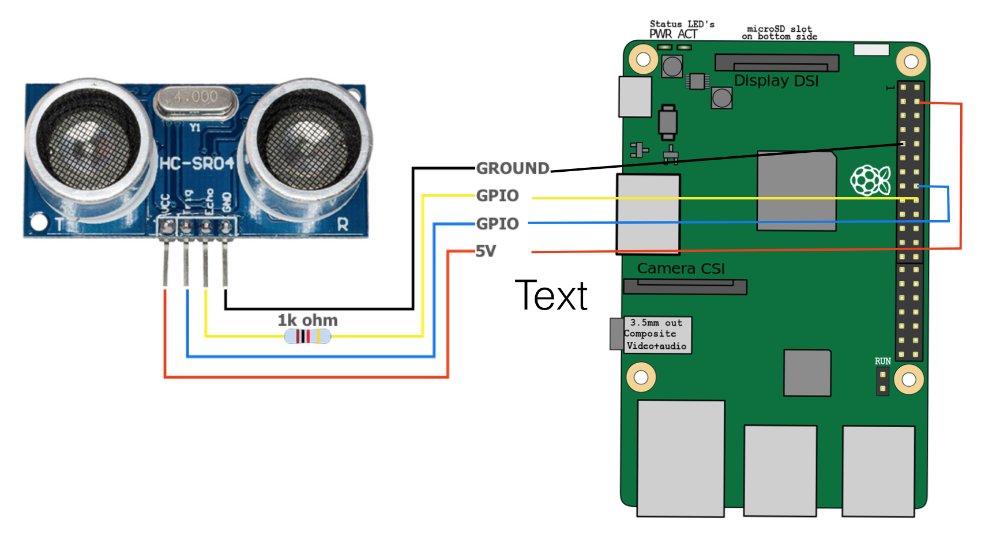
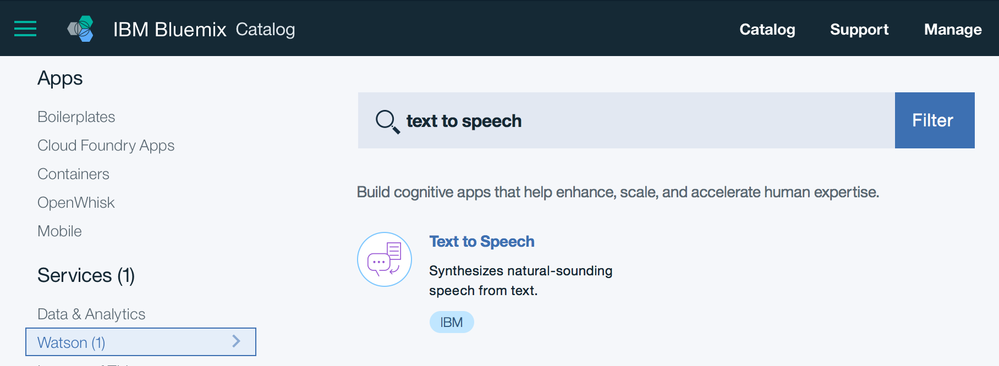
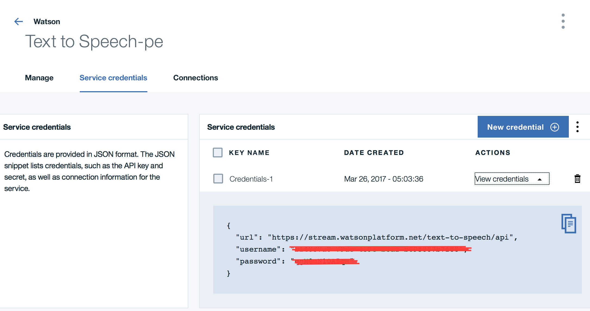

# Speak on distance

This recipe provides steps to build a simple robot which knows distance between itself and objects near by. If any object gets closer than 10 cm, the robot will speak up asking for privacy.

## Hardware requirements

- A Raspberry Pi B. I use Raspberry 3 for this tutorial, which has built-in wifi. If you have other models, need to make sure you have Wifi dongle or other ways to get your Pi connected to the internet (eg: sharing through ethernet, etc)
- HC-SR04 distance sensor
- 1K resistor
- Speaker. I use an Anker A7910 mini speaker

## Other requirements

- IBM Bluemix account ([free](https://bluemix.net))
- Refer to [this](https://www.youtube.com/watch?v=PPvIBH7M32Y) to know how to setup your Pi. Try to get the latest OS version.
- Git, Node.js, npm on your Raspberry: `sudo apt-get install nodejs npm node-semver`

## Steps to execute the recipe

### Wire up the parts



### Create Bluemix text to speech service

Login to Bluemix with your registered ID, Go to `Catalog`, Search for `text to speech` and select the service



Name the `service` and `credential` if you want, or just leave them by default, Select `Create`

Once the service is created, go to `Service credentials` , `View credentials` section to record the `username` and `password` information. You will need it later for the app. You can always create a new `credential` to access the service as needed, by selecting `New credential`



### Clone the code and install dependencies

Clone the source code:

From your Raspberry Pi, perform this command to get the source code:

`git clone https://github.com/dnguyenv/distance-bot.git`

Put your Watson service credential into the config.js file. You also can configure other values in the file to meet your need.

Run the code:

```
cd distance-bot
npm install
npm start
```

Demo:


